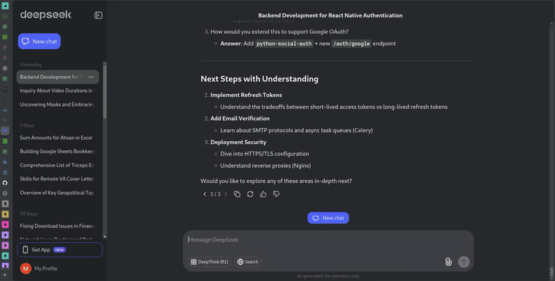

# DeepSeek Shortcuts Browser Extension

**DeepSeek Shortcuts** is a lightweight browser extension designed to enhance the user experience on [DeepSeek AI](https://chat.deepseek.com/) by providing intuitive keyboard shortcuts for efficient navigation and interaction.

## 🎥 Demo

See the extension in action below:



## 🚀 Features

This extension enables users to perform the following actions using shortcut keys:

- **Scroll Up One Message** – `Alt + A`
- **Scroll Down One Message** – `Alt + S`
- **Scroll to Top** – `Alt + T`
- **Scroll to Bottom** – `Alt + B`
- **Focus Chat Input** – `Alt + F`
- **Copy Last Response** – `Alt + R`
- **Copy Last Prompt** – `Alt + C`

## 🛠️ Installation

1. **Download the repository**:
   ```sh
    https://github.com/Arch-Laboratories/Deep-Keys.git
    ```

2. **Open Chrome Extensions Page**:
   - Go to `chrome://extensions/`
   - Enable **Developer Mode** (top-right corner).

3. **Load the Extension**:
   - Click on **Load unpacked**.
   - Select the folder where you cloned the repository.

4. The extension is now active and ready to use!

## 📜 Usage Instructions

Once installed, visit [DeepSeek AI](https://chat.deepseek.com/) and use the keyboard shortcuts for seamless navigation.

## 🔧 Configuration

The shortcut keys are defined in the `content.js` file. If you want to modify the default shortcuts:

1. Open `content.js` in a text editor.
2. Change the key bindings
3. Reload the extension.

## 🛡️ Permissions

The extension requests the following permissions:

- `activeTab` – To interact with the current active tab.  
- `scripting` – To inject scripts dynamically.  
- `host_permissions` – Limited to `https://chat.deepseek.com/*` for safety.  

## 🖥️ Technologies Used

- **JavaScript**  
- **HTML**  
- **CSS**  
- **Chrome Extensions API** 

## 📝 License

This project is licensed under the **MIT License**.